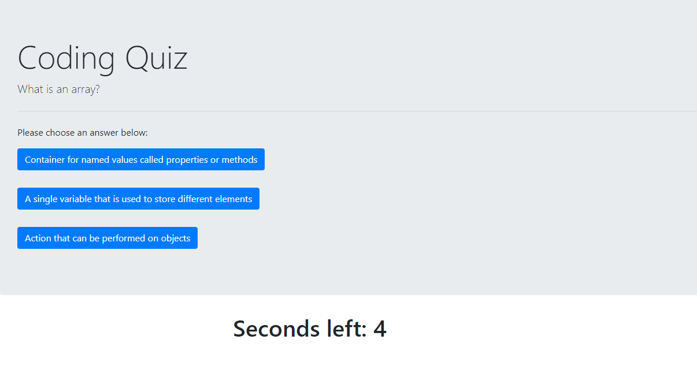

# 04-Code-Quiz
This project was very difficult. We had to start from nothing and create an HTML page (index.html) to layout what our coding quiz would look like. Then, format and stylize using CSS (style.css). After the content had been made, we had to create a quiz that timed you through a few questions about coding. Once you are done with the quiz, submit your initials and your score will populate on the page. 
 
 
https://github.com/ashley-ag/04-Code-Quiz
 
https://ashley-ag.github.io/04-Code-Quiz/
 
 
 
;
;
;
;
;